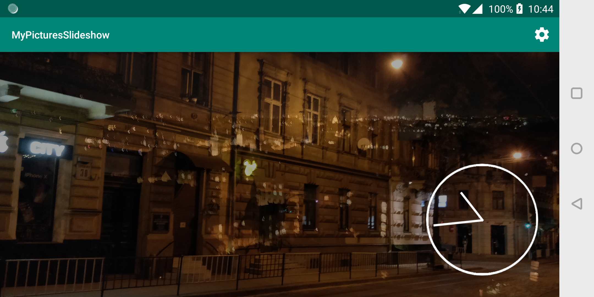
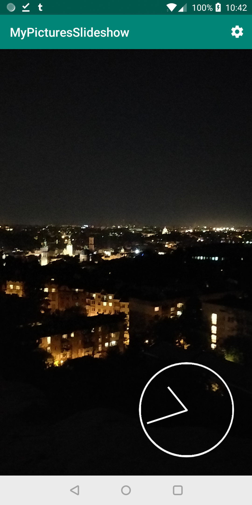

# MyPicturesSlideshow
Simple Android gallery slideshow application. 

### Features
* Shows random images from https://lorempixel.com
* Shows pictures and videos from your gallery if there are no connection (no transition animation for video yet)
* Analogue clock
* Configurable delay between slides

Takes advantage of [Android Jetpack's](https://developer.android.com/jetpack/):
* Architecture
* Navigation

## Build with
* [Android Studio](https://developer.android.com/studio/) should also work in other IDEs
* [Kotlin](https://kotlinlang.org/)
* [Gradle](https://gradle.org/)
* [OkHttp](http://square.github.io/okhttp/)
* [Custom Analog Clock View](https://github.com/rosenpin/custom-analog-clock-view)

## License
This project is licensed under the MIT License
